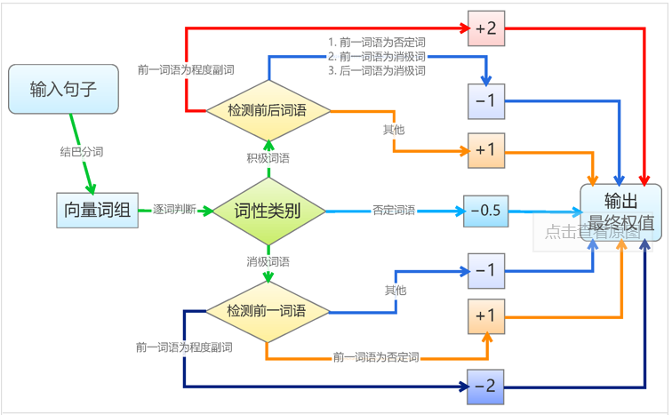
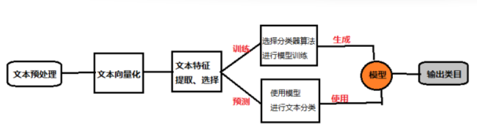

## 情感分析？

情感分析 (Sentiment Analysis)，也称倾向性分析，即对一个主观的文本分析判断说话者的情感色彩或者褒贬态度。

## 情感分析方法

### 1、基于情感词典的分析方法

（构建情感词典后统计文本极性词进行判断）

对大于句子力度的文本进行拆解句子操作，以句子为最小分析单元； 分析句子中出现的词语并按照情感词典匹配； 处理否定逻辑及转折逻辑；计算整句情感词得分（根据词语不同，极性不同，程度不同等因素进行加权求和）；根据情感得分输出句子情感倾向性。

实例：https://spaces.ac.cn/archives/3360

### 2、基于机器学习的情感分析方法

（将情感分析作为一个分类问题来处理）

* 文本预处理：分词，取出停用词，过滤低频词和无效字符，编码归一化等

* 文本特征向量化:

  1. Bag of Words

     词袋模型是将所有文本中单词形成一个字典vocab，然后根据字典来统计单词出现频数，文本中单词若出现在字典中，就将其向量值加1。

  2. Bag of ngrams

     n-gram是一种基于统计语言模型的算法。它的基本思想是文本里面的内容按照字节进行大小为n的滑动窗口操作，形成了长度是n的字节片段序列。

     以“我爱中国”为例：

     >  一元模型（unigram model）分为“我”“爱”“中”“国”；
     >
     > 二元模型（bigram model）分为“我爱”“爱中”“中国”
     >
     > 三元模型（trigram model）分为“我爱中”“爱中国”

     以此类推，分好词后，就可以像词袋模型的处理方式，按照词库去比较句子中出现的次数。n-gram能够比较好的记录句子中词之间的联系，n越大句子的完整度越高，但是随之而来的是词的维度成指数级增长。所以一般取n=2，n=3。

  3. TF-IDF

     TF-IDF是Term Frequency - Inverse Document Frequency的缩写，即“词频-逆文本频率”。它由两部分组成，TF和IDF。一个词的定量化表示是（词频*词的权重）`TF−IDF(x)=TF(x)∗IDF(x)`

  4. word2vec

     word2vec是google在2013年推出的一个NLP工具，它的特点是将所有的词向量化，这样词与词之间就可以定量的去度量他们之间的关系，挖掘词之间的联系。word2vec一般有CBOW和Skip-Gram模型。

     CBOW模型的训练输入是某一个特征词的上下文相关的词对应的词向量，而输出就是这特定的一个词的词向量，再通过深度学习训练出相应的固定维度的词向量。模型和模型相反，输入是中心词，输出是上下文。

* 传统机器学习算法：Logistic Regression，SVM，Naive Bayes，Neural Net，MaxEnt等

* 深度学习：CNN，RNN，LSTM都已经证明了很好的效果。

* 实例：https://spaces.ac.cn/archives/3414 、https://github.com/DefuLi/Emotional-Analysis-of-Internet-News

## 现在流行模型

大规模语料预训练（词向量/Elmo/GPT/Bert）+ 深度学习分类器（lstm/cnn/transformer） 

实例：[AI Challenger 2018：细粒度用户评论情感分类冠军思路总结](https://link.zhihu.com/?target=https%3A//mp.weixin.qq.com/s/FJtMDoNksSZLYdoEzixJTQ)

## 参考资料

### Github源码

① “互联网新闻情感分析”赛题，是CCF大数据与计算智能大赛赛题之一。对新闻情绪进行分类，0代表正面情绪、1代表中性情绪、2代表负面情绪。

https://github.com/DefuLi/Emotional-Analysis-of-Internet-News（基于LSTM神经网络）

② 本项目的数据来自“互联网新闻情感分析”赛题。使用Bert-As-Service库中的中文Bert模型进行句向量的提取，加入全连接层后进行三分类。

https://github.com/DefuLi/Emotional-Analysis-Bert-As-Service

③ 本项目的数据来自“互联网新闻情感分析”赛题。基于Transformer2.0库中的中文Bert模型，对新闻语料进行三分类。

https://github.com/DefuLi/Emotional-Analysis-Transformers2.0-Bert 

### 情感词典

- [词性字典1](https://link.zhihu.com/?target=https%3A//www.kaggle.com/rtatman/sentiment-lexicons-for-81-languages/version/1)[词性字典2](https://link.zhihu.com/?target=https%3A//github.com/l-passer/sentiment-analysis/tree/master/dict/emotion_dict)
- [大连理工大学中文情感词汇本体库](https://link.zhihu.com/?target=https%3A//download.csdn.net/download/qq280929090/10215956)
- [清华大学李军中文褒贬义词典](https://link.zhihu.com/?target=http%3A//download.csdn.net/download/qq280929090/10216029)
- [知网情感词典](https://link.zhihu.com/?target=http%3A//download.csdn.net/download/qq280929090/10216044)

### 情感数据集

- [大众点评细粒度用户评论情感数据集](https://link.zhihu.com/?target=https%3A//challenger.ai/competition/fsauor2018)
- [汽车行业用户观点主题及情感识别](https://link.zhihu.com/?target=https%3A//www.datafountain.cn/competitions/329/details/data-evaluation)
- [电商评论情感数据](https://link.zhihu.com/?target=https%3A//www.datafountain.cn/competitions/268/details/data-evaluation)
- [酒店评论语料](https://link.zhihu.com/?target=https%3A//download.csdn.net/download/qq280929090/9818883)
- [SemEval-2014 Task 4数据集](https://link.zhihu.com/?target=http%3A//download.csdn.net/download/qq280929090/10215935)
- [Citysearch corpus 餐馆评论数据](https://link.zhihu.com/?target=http%3A//download.csdn.net/download/qq280929090/10266761)
- [NLPCC2014评估任务2_基于深度学习的情感分类](https://link.zhihu.com/?target=http%3A//download.csdn.net/download/qq280929090/10216730)
- [NLPCC2013评估任务_中文微博观点要素抽取](https://link.zhihu.com/?target=http%3A//download.csdn.net/download/qq280929090/10216774)
- [NLPCC2013评估任务_中文微博情绪识别](https://link.zhihu.com/?target=http%3A//download.csdn.net/download/qq280929090/10216782)
- [NLPCC2013评估任务_跨领域情感分类](https://link.zhihu.com/?target=http%3A//download.csdn.net/download/qq280929090/10216785)
- [NLPCC2012评估任务_面向中文微博的情感分析](https://link.zhihu.com/?target=http%3A//download.csdn.net/download/qq280929090/10216795)
- [康奈尔大学影评数据集](https://link.zhihu.com/?target=http%3A//download.csdn.net/download/qq280929090/10216078)

### 其他资源

- [情感分析资源大全](https://link.zhihu.com/?target=https%3A//blog.csdn.net/qq280929090/article/details/70838025)
- Sentiment  Analysis with LSTMs in Tensorflow
- Sentiment analysis on tweets using Naive Bayes, SVM, CNN, LSTM, etc
- Chinese Shopping Reviews sentiment analysis
- 文本情感分析综述（腾讯语义团队）

 